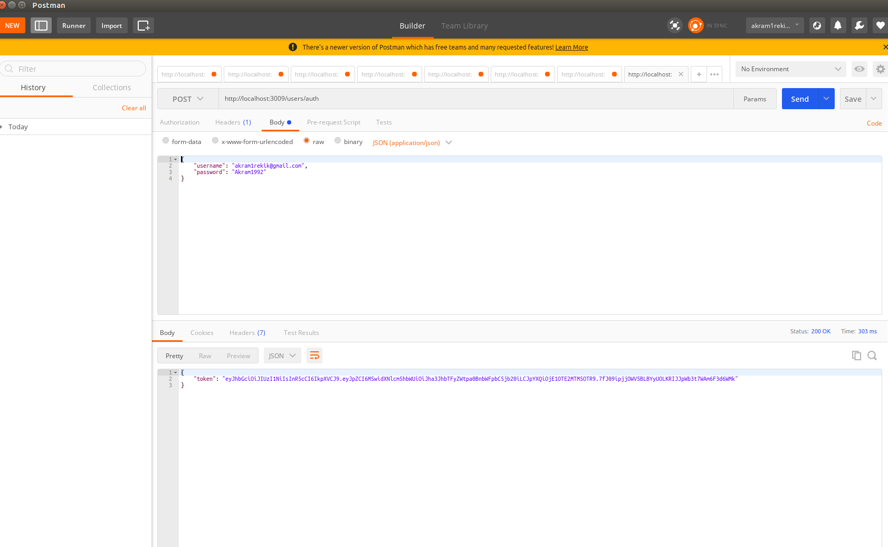
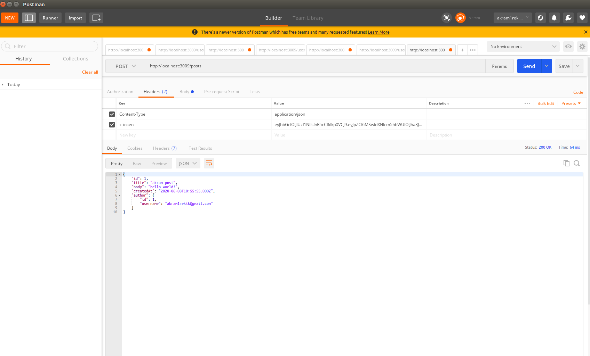

# Backend Code chanlenge

#Description
We will be building a simple backend for a “blog” type of website.

It should be written in TypeScript and Node.js and make use of either Sequelize or Bookshelf to organise and structure database alterations and act as the ORM for the backend application.

##Models
###Post - Represents a blog post — properties:

- `id` - UUID4 generated id
- `title` - The title of the post
- `body` - The body of the post 
- `author_id` - The id of the user who created the post
- `created_at` - The date in which the post was created (saved to db)

###User - Represents the writer of a post — properties:

- `id` - UUID4 generated id
- `username` - The username of the user
- `password` - A hashed representation of the user’s password

### Endpoints
####POST: /users - Creates a user — params:
- `username`  - The username to give the user
- `password` - The password the user wishes to have
- `@returns` - A secure authentication token

#####POST: /users/auth - Authenticates a user — params:

- `username` - The username of the user
- `password` - The password of the user
- `@returns` - A secure authentication token

#####GET: /posts - Returns all post (recent first) — params:

- `limit` - The max number of posts to return (default: 10)
- `@returns` - All the properties of the model

####GET: /posts/{id} - Returns the post for the given id:

- `@returns` - All the properties of the model

#####POST: /posts - Creates a new post — params:

- `HEADER: X-TOKEN` - The authentication token of the user
- `@returns` - All the properties of the newly created model


# My Solution

### Create Database and Models

```
$ npm run init-db
```

## Start the application
 
 First install npm modules
 
```
$ npm install
```

Then start the server

```
$ `npm run start:dev
```


## sample requests with Postman

1. authenticate a registered user




2. create a post by authenticated user

